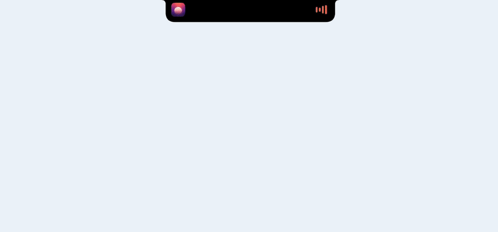
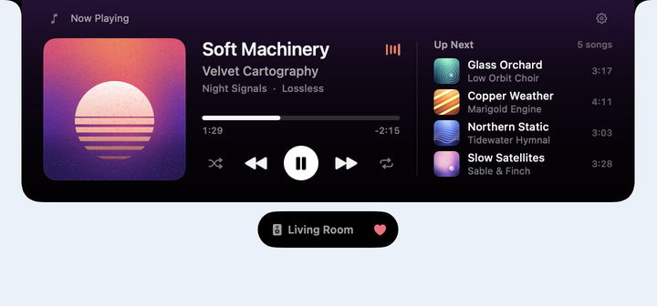
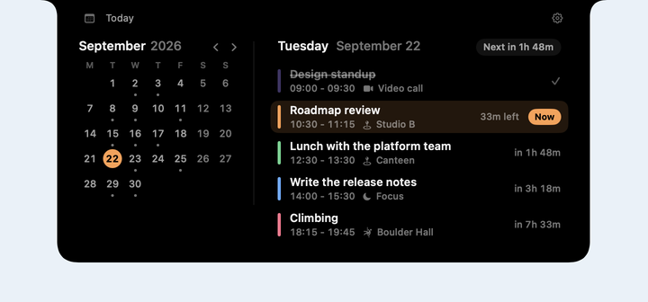
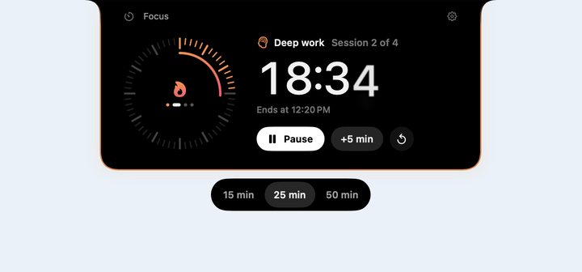
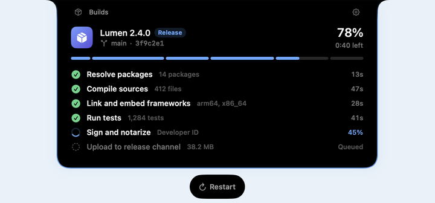
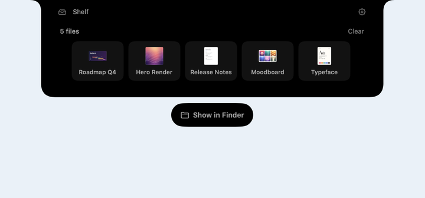

# OpenNook

[](https://github.com/twinkling-reality/opennook/actions/workflows/ci.yml)
[](LICENSE)
[](LICENSE-MIT-NOOKSURFACE)
[](https://swift.org)
[](#requirements)
[](https://swiftpackageindex.com/twinkling-reality/opennook)
[](https://swiftpackageindex.com/twinkling-reality/opennook)

**An open-source framework for building macOS notch apps.**

**Website:** [opennook.dev](https://opennook.dev) ·
**Docs:** [Getting started](https://opennook.dev/start/introduction/)

<p align="center">
  
</p>

OpenNook gives you the hard part for free: a polished window that lives in the
menu-bar notch, expands and collapses on hover, paints a proper frosted
backdrop, and ships with a settings shell and a global hotkey. Register your
home view through `NookConfiguration`; the top bar, Settings, hotkey, and
compact pill come for free. Optional `NookComponents` add-ons cover a file
shelf, a live-activity queue, and an ambient volume glyph.

It is a **base layer plus a working demo** - not a finished product. The demo
app is intentionally minimal: it shows the framework off and gives you a
known-good starting point to fork.

<table>
  <tr>
    <td width="50%" valign="top">
      
      <br><sub><b>Now playing.</b> Cover art drawn in code, the queue beside it, and where it plays in a companion below. <code>swift run ShowcaseNook --scene player</code></sub>
    </td>
    <td width="50%" valign="top">
      
      <br><sub><b>Agenda.</b> This month beside today's schedule. <code>swift run ShowcaseNook --scene agenda</code></sub>
    </td>
  </tr>
  <tr>
    <td width="50%" valign="top">
      
      <br><sub><b>Focus timer.</b> A countdown on a tick dial, session lengths in a companion, the rim lit while it runs. <code>swift run ShowcaseNook --scene timer</code></sub>
    </td>
    <td width="50%" valign="top">
      
      <br><sub><b>Build progress.</b> A release build step by step, with a card when it finishes. <code>swift run ShowcaseNook --scene progress</code></sub>
    </td>
  </tr>
</table>

Collapsed, the nook is a compact pill in the menu-bar notch (customizable
leading/trailing slots). Hover to expand on desktop, or press **⌥⌘;** to
toggle. Expanded, you get framework chrome (top bar, lock, settings) around
the view you register. Layout follows the display: notch-fused on notched
panels, floating capsule elsewhere (`NookPresentation`, overridable in
Settings). The looks above are scenes from `Examples/ShowcaseNook`, recorded
live from the running app; see [`docs/images/`](docs/images/README.md) for how they are made.

<p align="center">
  
  <br><sub><b>File shelf.</b> Files dropped on the notch, from the optional <code>NookComponents</code>. <code>swift run ShowcaseNook --scene shelf</code></sub>
</p>

## What's inside

OpenNook is two core Swift modules, an optional components library, a thin
demo app, and two ways to launch it.

### `NookSurface` - the notch window

The low-level chrome: the notch-shaped panel itself, its shape geometry,
hover behavior, expand/compact lifecycle, the translucent backdrop, and the
shimmer feedback overlay. This is a trimmed, renamed fork of
[DynamicNotchKit](https://github.com/MrKai77/DynamicNotchKit) and is licensed
MIT (see [Licensing](#licensing)).

You usually don't edit `NookSurface` - you drive it through `NookKit`.

### `NookKit` - the app chrome

Everything built on top of `NookSurface` to make it feel like an app:

- `App/AppCoordinator.swift` - lifecycle (show / hide / toggle, keep-open,
  reset settings); binds the notch backdrop to appearance preferences.
- `App/AppState.swift` - `viewMode`, `appearancePreferences`, visibility
  flags. Add your product state alongside these.
- `App/AppServices.swift` - an empty dependency container. Add your services
  (clipboard, networking, persistence...) here so view initializers stay put.
- `App/NookAppearancePreferences.swift` - persisted theme / surface style /
  haptics, with forwards-compatible `Codable` decoding.
- `App/Views/NookExpandedView.swift` - the framework chrome shell (top bar +
  Settings) that hosts the home view **you register** via `NookConfiguration`.
- `App/Views/NookTopBar.swift` - home glyph + lock (keep-open) + gear.
- `App/Views/Compact/CompactViews.swift` - the left/right slots flanking the
  physical notch when collapsed.
- `App/Views/Settings/` - Appearance, Display, Hotkey, and Data panels.
- `App/Views/Shared/` - reusable settings primitives.
- `System/HotkeyController.swift` - a Carbon-based global hotkey.

### `NookComponents` - optional add-ons

Opt-in components built on the layers above - depend on this product only when
you want one. It is not pulled in by `NookApp`.

- `Shelf/` - a file shelf: drop files onto the notch, they collect in a
  persistent `ShelfStore`, and you can drag them back out. Render it with
  `NookShelfView` and wire `ShelfStore.accept` into `NookConfiguration.onFileDrop`.
  See `Examples/ShelfNook`.
- `Activities/` - a priority live-activity queue: `NookActivityQueue` collects
  transient activities, orders them by priority, coalesces duplicates, and
  presents each by briefly taking over the expanded surface. Bind it via
  `NookConfiguration.onReady` and render with `NookActivityHost`. The queue
  yields the surface whenever the user is engaging it. See `Examples/ActivityNook`.
- `Volume/` - an ambient volume glyph: `SystemVolumeObserver` tracks the default
  output device's volume and mute via public CoreAudio APIs; `NookVolumeIndicator`
  renders it as a compact-slot glyph. It shows the level - it does not intercept
  or replace Apple's volume HUD. See `Examples/VolumeNook`.

### The demo app

- `Sources/NookApp/NookApp.swift` - the library entry point shared by both
  launch surfaces; sets up the `NSApplication`, the coordinator, and a
  menu-bar fallback.
- `Sources/NookExecutable/main.swift` - a three-line SPM trampoline so
  `swift run Nook` works.
- `App/main.swift` + `App/Info.plist` - the Xcode app-target trampoline and
  bundle metadata, for producing a real signed `.app`.

## Requirements

- macOS 15 or later
- Xcode command line tools
- [XcodeGen](https://github.com/yonaskolb/XcodeGen) (`brew install xcodegen`)
  - only if you want the Xcode project

## Build and run the demo

The fast path - a headless dev binary via SwiftPM:

```sh
swift build         # build
swift run Nook      # run the demo
swift test          # run the test suite
```

Once it's running, press **⌥⌘;** (or use the menu-bar item) to expand the
nook. You can rebind that shortcut in Settings -> Shortcut & nook.

For a real `.app` bundle (signing, notarization, Cmd-R in Xcode):

```sh
./Scripts/regenerate-xcodeproj.sh   # generates Nook.xcodeproj from project.yml
open Nook.xcodeproj
```

`Nook.xcodeproj` is a generated artifact and is gitignored - `project.yml` is
the source of truth. Regenerate it after a fresh clone or after editing
`project.yml`. Both build paths compile the same SwiftPM modules, so behavior
cannot drift between them.

## Example apps

Examples under `Examples/` show how to build on OpenNook through public API
only - no forking. All but the playground and the showcase are a single `main.swift`:

```sh
swift run HelloNook     # register one view, go
swift run ClockNook     # custom home view + a custom compact slot
swift run ThemedNook    # a host-supplied theme + lifecycle hooks
swift run ChromeNook    # the deeper chrome seams: launch defaults, notch fade, typing, labels, brand mark, status
swift run LayoutNook    # expanded width + nookContentInsets (avoid double horizontal padding)
swift run ShelfNook     # a drop-files-on-the-notch shelf (NookComponents)
swift run ActivityNook  # a priority live-activity queue (NookComponents)
swift run VolumeNook    # an ambient volume glyph in the compact pill (NookComponents)
swift run MultiNook     # multiple interchangeable modules sharing one surface
swift run CompanionNook # companion surfaces beside the nook, rim glow, scroll edge fade
swift run PlaygroundNook # change the running nook live, then export Swift or a JSON preset
swift run ShowcaseNook --scene player # finished-looking scenes: player, agenda, timer, progress, shelf, hud, compact
```

## Start your own notch app

You depend on OpenNook as a package and customize it through public API - you
do **not** fork the framework.

**1. Register a view.** Hand `NookApp.main` your expanded home view; the top
bar, Settings, hotkey, and compact pill all come for free:

```swift
import NookApp
import SwiftUI

NookApp.main { MyHomeView() }
```

**2. Customize via `NookConfiguration`** when you need more than a home view -
the compact slots, the chrome theme, the top bar's leading label/icon, the
chrome flags, lifecycle hooks, and file drops:

```swift
var configuration = NookConfiguration()
configuration.setHome { MyHomeView() }
configuration.setCompactTrailing { MyGlyph() }
configuration.theme = { appState in MyPalette.resolve(appState) }

// Top bar - leading cluster identity and chrome flags live on `topBar`.
configuration.topBar.leadingTitle = { _ in "Today" }  // default: "Home"
configuration.topBar.leadingIcon = "house"            // nil = brand mark; SF Symbol overrides
configuration.topBar.showsTopBar = true               // false strips top bar + gear + lock
configuration.topBar.showsSettings = true             // false drops the gear (top bar stays)
configuration.setTopBarTrailingItems { MyGlyph() }    // host actions left of the lock/gear

// Lifecycle hooks.
configuration.onExpand    = { print("nook expanded") }
configuration.onCompact   = { /* user dismissed / hover-exit collapsed the nook */ }
configuration.onHide      = { /* nook went hidden */ }
configuration.onFileDrop  = { urls in /* accept/reject dropped files */ true }
configuration.onReady     = { coordinator in /* post-launch handle for components */ }

NookApp.main(configuration)
```

Your views read the resolved palette from the `\.nookResolvedTheme`
environment value and shared services from `\.appServices`.

**3. Add your state and services.** `AppState`
(`Sources/NookKit/App/AppState.swift`) holds chrome state - add product state
alongside it; `AppServices` (`Sources/NookKit/App/AppServices.swift`) is the
dependency container threaded into views.

**4. Drive the chrome** through `AppCoordinator` - `showNook()`, `hideNook()`,
`toggleNook()`, `toggleKeepNookOpen()` are the lifecycle vocabulary; the global
hotkey and menu-bar fallback already call into them.

Rename the product (`Nook` -> your app) by editing `project.yml`,
`App/Info.plist`, and the `Package.swift` product name when you're ready to
ship.

## Deeper chrome customization

`NookConfiguration` exposes the rest of the chrome through additive, non-breaking
seams - every default reproduces the framework exactly, so you opt in only where
you need to. The [Chrome customization guide](https://opennook.dev/guides/chrome-customization/)
covers each seam in full; the headlines are below.

**Launch defaults.** Ship your own out-of-box appearance, global hotkey, and
display target. Seed-only: a value the user has changed in Settings always wins,
and the seed is never persisted (so a later build can revise it for untouched
users):

```swift
configuration.preferenceDefaults = NookPreferenceDefaults(
    appearance: NookAppearancePreferences(
        chromePalette: .dark, surfaceStyle: .translucent, presentation: .floating
    )
)
```

`surfaceStyle` is `.solid`, `.translucent`, or `.liquidGlass` - the real macOS 26
Liquid Glass material, with a pre-Tahoe approximation so the package still builds
and runs on earlier systems. See
[Surface materials](https://opennook.dev/guides/surface-materials/).

**Chrome behavior.** Hover side-effects, the cold-launch shimmer, and the
state->backdrop mapping. The resolver is re-run on every expand and collapse and
receives a `NookBackdropContext`, so the collapsed pill and the expanded panel can
be painted differently:

```swift
configuration.chromeBehavior = NookChromeBehavior(
    hoverBehavior: .all,         // default []: opt into hover haptics / keep-visible
    showsLaunchShimmer: false,   // default true: launch silently
    backdrop: { context in
        context.isExpanded
            ? .vibrancy(.init(material: .hudWindow, darkenOpacity: 0.3))
            : .solid(.black)     // collapsed: read as the hardware notch
    }
)
```

**Labels, metrics, motion.** Localize chrome strings, tune the few fixed layout
values, retune the in-panel springs:

```swift
configuration.labels.settingsBreadcrumb = "Préférences"
configuration.metrics.compactSlotSize = 28
configuration.motion.viewModeChange = .snappy
```

**Status banner.** Post info / success / warning / error from any `AppState`
handle; suppress the framework banner if you render your own:

```swift
appState.showStatus("Imported 3 files", severity: .success)
configuration.topBar.showsStatusBanner = false
```

**Companion surfaces.** Float your own controls beside the nook - one button, a
group, several groups - anchored to the chrome (below, leading, or trailing), shown
in the compact state, the expanded state, or both, and moving with its expand and
collapse in every layout. Companions share one size so neighbours line up, are drawn
by a style you pick or write (with fade, edge, shadow, and hover), come and go with a
presence effect, and can be added and removed while the app runs. Clicking one never
takes focus from the nook. See
[Companion surfaces](https://opennook.dev/guides/companion-surfaces/) and
`Examples/CompanionNook`:

```swift
configuration.companionStyle = .faded
configuration.addCompanion(id: "actions", anchor: .below, spacing: 10) { ActionPill() }
configuration.addCompanion(id: "timer", visibility: .both, shape: .circle, presence: .pop) {
    TimerButton()  // a view with Button(...).buttonStyle(.nookGlyph)
}
```

**Top bar controls anywhere.** Take the keep-open lock or the Settings gear out of
the top bar without losing the feature, and show the framework's own controls in a
companion (or build yours on `\.nookChromeActions`):

```swift
configuration.topBar.showsKeepOpenButton = false
configuration.topBar.showsSettingsButton = false
configuration.addCompanion(id: "controls", anchor: .trailing, hidesInSettings: false) {
    ChromeControls()  // a view stacking NookKeepOpenButton() and NookSettingsButton()
}
```

**Clear of the notch.** Content starts below the hardware notch even with the top bar
hidden, and small views can sit beside the notch in the band the bar would fill. See
[Layout and content insets](https://opennook.dev/guides/layout-and-insets/#clearing-the-notch):

```swift
configuration.topBar.showsTopBar = false
configuration.topBar.notchClearance = .automatic  // .manual lets content run up beside the notch

// In your home view's body:
PlayerView().nookNotchAccessories { Image(systemName: "music.note") } trailing: { NookKeepOpenButton() }
```

**Rim glow and edge fade.** Light a glowing rim around the panel to signal state,
and soften scrolling content where it meets the panel's edges (Apple's soft scroll
edge effect on macOS 26, a gradient mask on macOS 15). See
[Rim glow and edge fade](https://opennook.dev/guides/panel-effects/):

```swift
MyHomeView().nookRimGlow(model.isWorking ? .blue : nil)  // opt in by publishing a color
configuration.scrollEdgeFade = .standard                   // Settings, the shelf, and
ScrollView { rows }.nookScrollEdgeFade(axes: .vertical)     // your marked scroll views
```

**Live configuration.** A module whose configuration depends on runtime state
rebuilds it in place, and the host's chrome behavior can change while it runs.
`swift run PlaygroundNook` is built on these: tweak the running nook from a
controls window, then copy the result as Swift or a JSON preset. See
[Playground](https://opennook.dev/guides/playground/):

```swift
withAnimation { coordinator.reloadActiveConfiguration() }    // calls makeConfiguration() again
coordinator.replaceChromeBehavior(NookChromeBehavior(hoverBehavior: .hapticFeedback))
```

**Identity.** Name the product, drop in a custom brand mark (replaces the OpenNook
glyph in the top bar, About card, and menu bar), or turn the menu-bar item off -
all reachable from a single-module `NookConfiguration`:

```swift
configuration.branding = NookHostBranding(
    hostName: "ContextNook",
    hostTagline: "A focused notch app.",
    mark: { size, color in AnyView(MyMark(color: color).frame(width: size, height: size)) }
)
configuration.showsMenuBarExtra = false
```

## Multiple modules in one notch

A single host can run several interchangeable *modules* - independent notch
apps sharing one surface, one menu bar, and one set of preferences. Each
module ships its own `NookConfiguration`, its own services, and an optional
global shortcut for direct-jump or cycle-through. Use this when the notch
should host distinct surfaces (a clock, a counter, a notepad) that the user
flips between rather than nesting inside one home view.

```swift
import NookApp

var host = NookHostConfiguration()

// A NookModule type that builds its own configuration and services.
host.register(CounterModule.moduleDescriptor) { context in
    CounterModule(context: context)
}

// Or just register a configuration closure for the simpler cases.
host.register(
    NookModuleDescriptor(id: "com.example.clock", displayName: "Clock", icon: "clock"),
    configuration: { clockConfiguration() }
)

host.defaultModule = CounterModule.moduleDescriptor.id
host.moduleCycleHotkey = NookHotkey(keyCode: 50, carbonModifiers: 4096 | 2048, keySymbol: "`")

// Host-product identity - the framework chrome (About card, show/hide hotkey
// label, menu-bar fallback) reads `hostName` and `hostTagline` from here.
// Defaults reproduce the demo strings exactly.
host.branding = NookHostBranding(
    hostName: "ContextNook",
    hostTagline: "Three modules, one notch."
)

NookApp.main(host)
```

By default the switcher lives in the menu-bar item (a "Modules" section) plus
the cycle / per-module hotkeys - nothing is planted in a module's expanded
surface. Set `host.moduleSwitcherPlacement = .leadingCluster` for a compact
in-surface switcher folded into the top bar, or `.none` for hotkeys only.

The active module's hooks/services drive the surface; switching is one
atomic transaction on the lifecycle chain (no half-applied state, no
arbiter claims leaking across modules). See `Examples/MultiNook/main.swift`
for the full pattern - a `NookModule` class with a typed `ServiceKey`-backed
dependency, three modules with per-module top-bar identity, and the
closure-registration shortcut for the simpler ones.

## Shipping checklist

The `swift run` paths are for the dev loop. To ship a real signed `.app`
you need a few extra pieces - most of them tiny, none of them magic.

- **Bundle identity.** Rename the product in three places: `Package.swift`
  (the `.executable(name:)` and `.library(name:)`), `project.yml`
  (`name:`, `targets:`, `PRODUCT_BUNDLE_IDENTIFIER`), and `App/Info.plist`
  (`CFBundleIdentifier`, `CFBundleName`). The reverse-DNS id you pick is
  used by `NookModuleContext.makeDefault` to name on-disk containers and
  per-module `UserDefaults` suites, so pick before you ship.
- **Persistence suites.** `NookKit` writes its own preferences into
  `UserDefaults.standard` under the `opennook.*` prefix (`opennook.appearance.v1`,
  `opennook.display.v1`, `opennook.hotkey.v1`, `opennook.module.default`);
  `NookComponents.Shelf` writes `nook.shelf.items`. If you're using
  `NookHostConfiguration`, each module gets its own `UserDefaults` suite via
  `NookModuleContext`. Don't collide host product state with the `opennook.*`
  or `nook.shelf.*` keys.
- **Entitlements.** A ready-to-copy template lives at
  [`App/Nook.entitlements`](App/Nook.entitlements) with the minimum that lets
  every framework feature work inside the App Sandbox:
  `com.apple.security.app-sandbox`,
  `com.apple.security.files.user-selected.read-write` (shelf drag-in and the
  file picker - see below), `com.apple.security.files.bookmarks.app-scope`
  (scoped-bookmark persistence). It is intentionally *not* wired into the build
  by default, so the demo and the dev loop stay unsandboxed; to actually sandbox
  the app, add `CODE_SIGN_ENTITLEMENTS: App/Nook.entitlements` to the
  `NookHostApp` target in `project.yml` and regenerate. The global hotkey is
  Carbon and needs no entitlement. CoreAudio default-output listening is
  read-only and needs no entitlement. The shelf detects the sandbox at runtime
  (`ShelfRuntime.isSandboxed`) and switches to a stricter acceptance mode.
- **File pickers.** Modules present open/save panels through the host's
  `NookFilePicker` (resolved from `\.appServices` via `NookFilePickerKey`), which
  activates the app so the panel is interactive from the non-activating notch
  panel and holds the surface open while it's up. Two caveats: (1) under the
  sandbox, `files.user-selected.read-write` is what makes a picked file readable,
  so ship the entitlement above; (2) under `swift run` the binary is unbundled
  and unsandboxed with no powerbox, so the panel can't enter TCC-protected
  folders (Downloads, Desktop, Documents) - run the signed `.app` (the
  `NookHostApp` target, e.g. Cmd-R in Xcode) or grant your terminal Full Disk
  Access. This is a dev-loop artifact, not a shipping limitation.
- **Menu-bar accessory, no Dock.** Set `LSUIElement = true` in
  `Info.plist` if you want the menu-bar-only behavior the demo ships.
- **Hardened runtime + notarization** for distribution outside the Mac
  App Store. Sign with a Developer ID, enable hardened runtime, notarize.
  None of OpenNook's APIs require runtime exceptions.

## Licensing

OpenNook is licensed under the **Apache License 2.0** - see [`LICENSE`](LICENSE).

The `Sources/NookSurface/` subtree is licensed **MIT** instead, because it is
derived from [DynamicNotchKit](https://github.com/MrKai77/DynamicNotchKit) by
Kai Azim. See [`LICENSE-MIT-NOOKSURFACE`](LICENSE-MIT-NOOKSURFACE),
[`ThirdPartyLicenses/DynamicNotchKit.txt`](ThirdPartyLicenses/DynamicNotchKit.txt),
and [`NOTICE.md`](NOTICE.md) for the full license map.

Both licenses are permissive - you can build and ship a closed-source product
on top of OpenNook.
