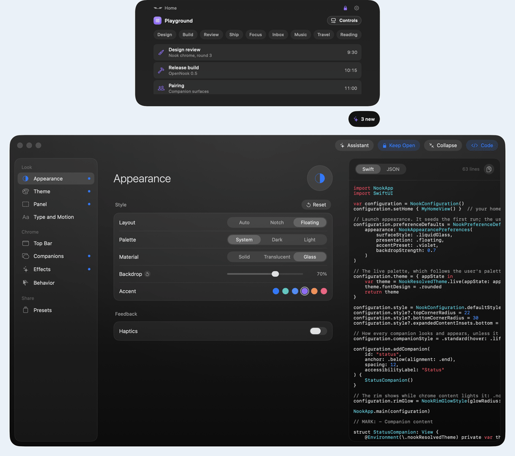

# OpenNook

[](https://github.com/twinkling-reality/opennook/actions/workflows/ci.yml)
[](LICENSE)
[](LICENSE-MIT-NOOKSURFACE)
[](https://swift.org)
[](#requirements)
[](https://swiftpackageindex.com/twinkling-reality/opennook)
[](https://swiftpackageindex.com/twinkling-reality/opennook)

**An open-source framework for building macOS notch apps.**

**Website:** [opennook.dev](https://opennook.dev) ·
**Docs:** [Getting started](https://opennook.dev/start/introduction/)

<p align="center">
  
</p>

OpenNook gives you the hard part for free: a polished window that lives in the
menu-bar notch, expands and collapses on hover, paints a proper frosted
backdrop, and ships with a settings shell and a global hotkey. Register your
home view through `NookConfiguration`; the top bar, Settings, hotkey, and
compact pill come for free. Optional `NookComponents` add-ons cover a file
shelf, a live-activity queue, and an ambient volume glyph.

It is a **base layer plus a working demo** - not a finished product. The demo
app is intentionally minimal: it shows the framework off and gives you a
known-good starting point to fork.

<table>
  <tr>
    <td width="50%" valign="top">
      
      <br><sub><b>Now playing.</b> Cover art drawn in code, the queue beside it, and where it plays in a companion below. <code>swift run ShowcaseNook --scene player</code></sub>
    </td>
    <td width="50%" valign="top">
      
      <br><sub><b>Agenda.</b> This month beside today's schedule. <code>swift run ShowcaseNook --scene agenda</code></sub>
    </td>
  </tr>
  <tr>
    <td width="50%" valign="top">
      
      <br><sub><b>Focus timer.</b> A countdown on a tick dial, session lengths in a companion, the rim lit while it runs. <code>swift run ShowcaseNook --scene timer</code></sub>
    </td>
    <td width="50%" valign="top">
      
      <br><sub><b>Build progress.</b> A release build step by step, with a card when it finishes. <code>swift run ShowcaseNook --scene progress</code></sub>
    </td>
  </tr>
</table>

Collapsed, the nook is a compact pill in the menu-bar notch (customizable
leading/trailing slots). Hover to expand on desktop, or press **⌥⌘;** to
toggle. Expanded, you get framework chrome (top bar, lock, settings) around
the view you register. Layout follows the display: notch-fused on notched
panels, floating capsule elsewhere (`NookPresentation`, overridable in
Settings). The looks above are scenes from `Examples/ShowcaseNook`, recorded
live from the running app; see [`docs/images/`](docs/images/README.md) for how they are made.

<p align="center">
  
  <br><sub><b>File shelf.</b> Files dropped on the notch, from the optional <code>NookComponents</code>. <code>swift run ShowcaseNook --scene shelf</code></sub>
</p>

<p align="center">
  
  <br><sub><b>Playground.</b> Change the running nook from a controls window,
  then copy the result as Swift or a JSON preset.
  <code>swift run PlaygroundNook</code></sub>
</p>

## What's inside

- **`NookSurface`** - the notch window itself: shape geometry, hover behavior,
  the expand/compact lifecycle, the translucent backdrop, the shimmer overlay.
  A trimmed, renamed fork of
  [DynamicNotchKit](https://github.com/MrKai77/DynamicNotchKit), licensed MIT
  (see [Licensing](#licensing)). You drive it through `NookKit`.
- **`NookKit`** - the app chrome on top of it: lifecycle (`AppCoordinator`),
  state (`AppState`), a dependency container (`AppServices`), persisted
  appearance preferences, the top bar and Settings shell that host your
  registered home view, the compact slots, and the global hotkey.
- **`NookApp`** - the one-line entry point that wires the `NSApplication`, the
  coordinator, the menu-bar fallback, and your view together.
- **`NookComponents`** - opt-in add-ons, not pulled in by `NookApp`: a file
  shelf, a priority live-activity queue, and an ambient volume glyph.

File-by-file, including the demo app's two launch surfaces:
[Repository map](docs/architecture.md). Conceptually:
[Introduction](https://opennook.dev/start/introduction/).

## Requirements

- macOS 15 or later
- Swift 5.9 or later, and the Xcode command line tools
- [XcodeGen](https://github.com/yonaskolb/XcodeGen) (`brew install xcodegen`)
  - only if you want the Xcode project

## Install

Add the package to your `Package.swift`, then depend on `NookApp` (and
`NookComponents` if you want the add-ons):

```swift
.package(url: "https://github.com/twinkling-reality/opennook", from: "0.4.0"),
```

In Xcode: File -> Add Package Dependencies, paste the same URL. Full
instructions: [Install](https://opennook.dev/start/install/).

## A minimal nook

Hand `NookApp.main` your expanded home view; the top bar, Settings, hotkey, and
compact pill all come for free:

```swift
import NookApp
import SwiftUI

NookApp.main { MyHomeView() }
```

When you need more than a home view - compact slots, a theme, top-bar identity,
lifecycle hooks, file drops - take the `NookConfiguration` overload:

```swift
var configuration = NookConfiguration()
configuration.setHome { MyHomeView() }
configuration.setCompactTrailing { MyGlyph() }
configuration.theme = { appState in MyPalette.resolve(appState) }
configuration.onFileDrop = { urls in /* accept/reject dropped files */ true }

NookApp.main(configuration)
```

Your views read the resolved palette from the `\.nookResolvedTheme`
environment value and shared services from `\.appServices`. The four-step
walkthrough - register, configure, add state and services, drive the chrome -
is [Your first nook](https://opennook.dev/start/first-nook/).

## Build and run the demo

The fast path - a headless dev binary via SwiftPM:

```sh
swift build         # build
swift run Nook      # run the demo
swift test          # run the test suite
```

Once it's running, press **⌥⌘;** (or use the menu-bar item) to expand the
nook. You can rebind that shortcut in Settings -> Shortcut & nook.

For a real `.app` bundle (signing, notarization, Cmd-R in Xcode):

```sh
./Scripts/regenerate-xcodeproj.sh   # generates Nook.xcodeproj from project.yml
open Nook.xcodeproj
```

`Nook.xcodeproj` is a generated artifact and is gitignored - `project.yml` is
the source of truth. Regenerate it after a fresh clone or after editing
`project.yml`. Both build paths compile the same SwiftPM modules, so behavior
cannot drift between them.

## Example apps

Examples under `Examples/` show how to build on OpenNook through public API
only - no forking. All but the playground and the showcase are a single `main.swift`:

```sh
swift run HelloNook     # register one view, go
swift run ClockNook     # custom home view + a custom compact slot
swift run ThemedNook    # a host-supplied theme + lifecycle hooks
swift run ChromeNook    # the deeper chrome seams: launch defaults, notch fade, typing, labels, brand mark, status
swift run LayoutNook    # expanded width + nookContentInsets (avoid double horizontal padding)
swift run ShelfNook     # a drop-files-on-the-notch shelf (NookComponents)
swift run ActivityNook  # a priority live-activity queue (NookComponents)
swift run VolumeNook    # an ambient volume glyph in the compact pill (NookComponents)
swift run MultiNook     # multiple interchangeable modules sharing one surface
swift run CompanionNook # companion surfaces beside the nook, rim glow, scroll edge fade
swift run PlaygroundNook # change the running nook live, then export Swift or a JSON preset
swift run ShowcaseNook --scene player # finished-looking scenes: player, agenda, timer, progress, shelf, hud, compact
```

Each one, grouped and explained:
[Examples](https://opennook.dev/guides/examples/).

## Customize the chrome

`NookConfiguration` exposes the rest of the chrome through additive,
non-breaking seams - every default reproduces the framework exactly, so you opt
in only where you need to. `swift run PlaygroundNook` is the fastest way to see
them: change the running nook from a controls window, then copy the result as
Swift or a JSON preset.

| You want | Seam | Guide |
| --- | --- | --- |
| Launch defaults, hover and shimmer, the backdrop resolver, labels, metrics, motion, branding, the status banner | `preferenceDefaults`, `chromeBehavior`, `labels`, `metrics`, `motion`, `branding` | [Chrome customization](https://opennook.dev/guides/chrome-customization/) |
| A host palette for the chrome | `configuration.theme` | [Theming](https://opennook.dev/guides/theming/) |
| Solid, translucent, or real Liquid Glass | `surfaceStyle` | [Surface materials](https://opennook.dev/guides/surface-materials/) |
| The top bar, the lock and gear, the Settings screens | `configuration.topBar` | [Settings chrome](https://opennook.dev/guides/settings-chrome/) |
| Expanded width, content insets, clearing the notch | `expandedWidth`, `nookContentInsets`, `notchClearance` | [Layout and content insets](https://opennook.dev/guides/layout-and-insets/#clearing-the-notch) |
| Controls floating beside the nook | `addCompanion`, `companionStyle` | [Companion surfaces](https://opennook.dev/guides/companion-surfaces/) |
| A glowing rim, faded scroll edges | `nookRimGlow`, `scrollEdgeFade` | [Rim glow and edge fade](https://opennook.dev/guides/panel-effects/) |
| Typing and shortcuts inside the nook | `\.nookChromeActions` | [Typing in the nook](https://opennook.dev/guides/keyboard/) |
| Which display the nook lives on | Settings -> Display | [Displays](https://opennook.dev/guides/displays/) |
| Rebuilding configuration while it runs | `reloadActiveConfiguration`, `replaceChromeBehavior` | [Playground](https://opennook.dev/guides/playground/) |
| Several interchangeable notch apps in one process | `NookHostConfiguration`, `NookModule` | [Multiple modules](https://opennook.dev/guides/multiple-modules/) |
| The shelf, the activity queue, the volume glyph | `NookComponents` | [File shelf](https://opennook.dev/guides/file-shelf/), [Activity queue](https://opennook.dev/guides/activity-queue/), [Volume glyph](https://opennook.dev/guides/volume-glyph/) |

## Ship it

`swift run` is the dev loop. A real signed `.app` needs bundle identity in
three places (`Package.swift`, `project.yml`, `App/Info.plist`), a product
prefix that does not collide with the framework's `opennook.*` and
`nook.shelf.*` preference keys, the entitlements template at
[`App/Nook.entitlements`](App/Nook.entitlements) if you sandbox, `LSUIElement`
for menu-bar-only behavior, and hardened runtime plus notarization. None of
OpenNook's APIs require runtime exceptions. The checklist in full:
[Shipping](https://opennook.dev/guides/shipping/).

## Documentation

- [Getting started](https://opennook.dev/start/introduction/) and
  [Your first nook](https://opennook.dev/start/first-nook/)
- [API reference](https://opennook.dev/reference/api/) and
  [Troubleshooting](https://opennook.dev/reference/troubleshooting/)
- [Repository map](docs/architecture.md) - what lives where in this repo
- [README media](docs/images/README.md) - how the images above are made
- [Contributing](CONTRIBUTING.md)
- Swift Package Index:
  [package page](https://swiftpackageindex.com/twinkling-reality/opennook) ·
  [generated documentation](https://swiftpackageindex.com/twinkling-reality/opennook/documentation)

## Licensing

OpenNook is licensed under the **Apache License 2.0** - see [`LICENSE`](LICENSE).

The `Sources/NookSurface/` subtree is licensed **MIT** instead, because it is
derived from [DynamicNotchKit](https://github.com/MrKai77/DynamicNotchKit) by
Kai Azim. See [`LICENSE-MIT-NOOKSURFACE`](LICENSE-MIT-NOOKSURFACE),
[`ThirdPartyLicenses/DynamicNotchKit.txt`](ThirdPartyLicenses/DynamicNotchKit.txt),
and [`NOTICE.md`](NOTICE.md) for the full license map.

Both licenses are permissive - you can build and ship a closed-source product
on top of OpenNook.
