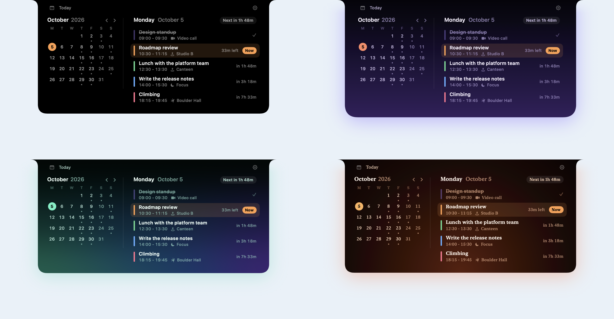

The nook's chrome - top bar, compact pill, banner, Settings, companions, and the
surface itself - is drawn from one value: a `NookTheme`. A theme is plain data, so
you can write it in Swift, load it from a JSON file, ship several, and reload one
live while you edit it.

You can leave all of this alone (the standard theme is the framework's own look,
value for value), turn a few knobs, or override any single part of the chrome.

```swift
NookApp.main(theme: NookTheme(accent: "#3399FF", radius: .large)) { MyHomeView() }
```



The same scene in the standard theme and in the three [sample theme files](#samples):
Dusk, Aurora, and Ember. Only the theme changes; the app is the same.

## Three tiers

A theme has three layers. Each layer defaults from the one above it, so changing
one value moves everything that follows it.

| Tier | What it is | Example |
|---|---|---|
| Knobs | A dozen properties on `NookTheme` | `accent`, `radius`, `scale`, `fontDesign`, `motion` |
| Semantic tokens | Shared values the chrome defaults from | `space.md`, `radius.lg`, `type.body`, `color.label.secondary`, `spring.default` |
| Component tokens | One per chrome field: every `NookChromeMetrics`, `NookChromeTypography`, and `NookChromeMotion` field | `banner.cornerRadius`, `banner.message.font`, `motion.statusBanner` |

`banner.cornerRadius` defaults to `{radius.md}`, which is 10 at the standard
radius; `banner.padding.vertical` defaults to 7 at scale 1; `topBar.height` stays
24 whatever the scale, because it is tied to the menu bar. With
`NookTheme.standard` every value resolves to exactly what the chrome drew before
themes existed.

### Knobs

```swift
var theme = NookTheme(
    accent: "#3399FF",          // color.accent: interactive tint
    radius: .large,             // .none, .small, .standard, .large, or .factor(1.25)
    scale: 1.05,                // spacing and type, 0.5...2
    fontDesign: .rounded,       // cascaded over the chrome's text
    fontWidth: .condensed,
    motion: .calm               // .standard, .calm (no overshoot), .expressive
)
theme.soundVolume = 0.6         // multiplies every sound's volume; see Sounds below
```

Four knobs pin a choice the person would otherwise make in Settings; see
[Host theme and the person's choices](#host-theme-and-the-persons-choices).

### Tokens

Override any token by id. Each kind of token has its own id type, so a color cannot
land where a length belongs:

```swift
var theme = NookTheme()
theme.tokens[.spaceMD] = 9                                    // every gap that defaults to it
theme.tokens[.labelSecondary] = .adaptive(.init(dark: .white(opacity: 0.66), light: .black(opacity: 0.55)))
theme.tokens[.destructive] = "#FF453A"
theme.tokens[.bannerCornerRadius] = .token(.radiusLG)         // a component token
theme.tokens[.bannerMessage] = NookFontSpec(role: .typeBody, weight: .semibold)
theme.tokens[.statusBanner] = .reference(.springSnappy)
theme.tokens[.chrome] = NookShadowSpec(color: .black(opacity: 0.35), radius: 12, y: 4)
```

Numbers are written at scale 1: a spacing or type token multiplies a number by the
`scale` knob, and a radius token by the `radius` knob. A reference takes the other
token's value, already scaled.

The color roles are `color.label.primary`, `.secondary`, `.tertiary`,
`.quaternary`, `color.fill.subtle`, `color.stroke.subtle`, `color.icon.inactive`,
`color.accent`, `color.surface` (the solid backdrop), `color.hoverWash`,
`color.destructive`, `color.warning`, `color.success`, `feedback.tint`, and the
banner's `banner.severity.error.color` (and `warning`, `info`, `success`). Every id
the framework defines, with its default, is listed in
`Sources/NookKit/Theme/NookTokenCatalog.swift`.

A tool that lists or edits tokens - an editor, an inspector, a model choosing values -
can read the same list at run time instead of keeping its own.
`NookTokenDescriptor.all` describes every token: its id, kind, tier, default, and for a
number the knob that scales it and its unit. `NookThemeTokens.value(for:)` and
`setValue(_:for:)` read and write an override by id as a `NookTokenValue`, and
`NookTheme.resolvedValue(for:in:)` says what a token comes to, with references
followed and the knobs applied. `NookThemeTokens` is also `Codable`, as one flat
object keyed by id. The [playground's Tokens page](/guides/playground/#the-tokens-page)
is built on these.

```swift
for token in NookTokenDescriptor.all where token.kind == .dimension {
    print(token.id, token.unit as Any, token.defaultValue as Any)
}
var tokens = NookThemeTokens()
tokens.setValue(.dimension(12), for: "banner.cornerRadius")    // false for a wrong kind or id
let context = NookThemeContext(isDark: true)
let radius = NookTheme(tokens: tokens).resolvedValue(for: "banner.cornerRadius", in: context)
```

## Using a theme

Set it on the configuration, or on the host for every module:

```swift
var configuration = NookConfiguration()
configuration.setHome { MyHomeView() }
configuration.chromeTheme = theme
NookApp.main(configuration)

var host = NookHostConfiguration()
host.chromeTheme = theme            // modules without a theme of their own use this one
```

A module's theme replaces the host's as a whole. When a module switch (or a
background module's urgent activity) puts a module's content on the surface, the
chrome applies that module's look in the same animation: its palette, metrics,
type, and motion, and its shape, curves, shadow, wash, backdrop, and window
appearance.

Explicit settings still win where you set them:

- A `NookConfiguration.theme` closure replaces the theme's palette as a whole. It
  is the escape hatch for a palette computed from app state; prefer the theme's
  color tokens for a palette that is data.
- A non-`nil` `style` or `transitions` replaces the theme's shape or curves.
- A `chromeBehavior.backdrop` resolver replaces the theme's backdrops.
- A field of `metrics`, `typography`, or `motion` that differs from its framework
  default replaces that field. A field set back to its default reads as unset, so
  under a theme that changes it, set the token instead.

## Reading the theme in views

The resolved palette is in the environment, as it always was:

```swift
struct MyHomeView: View {
    @Environment(\.nookResolvedTheme) private var theme
    @Environment(\.nookThemeTokens) private var tokens

    var body: some View {
        VStack(spacing: tokens[.spaceSM]) {
            Image(systemName: "sparkles").foregroundStyle(theme.secondaryLabel)
            Text("Hello").font(tokens[.typeBody]).foregroundStyle(theme.primaryLabel)
        }
        .padding(tokens[.spaceMD])
    }
}
```

`NookResolvedTheme` has the label, fill, and stroke slots, `accent`, `fontDesign`,
and the `hoverWash`, `destructive`, `warning`, and `success` roles.
`\.nookTheme` is the theme itself: resolve a `NookColorValue` you were handed with
`theme.resolve(color, in: context)`, so `"accent"` means the host's accent. Per-part
colors the theme sets are in `\.nookChromeColors`.

## Theme files

A theme file is a `NookTheme` with an envelope. It lists only what differs from the
standard theme:

```json
{
  "format": "opennook.theme",
  "version": 1,
  "name": "Graphite",
  "accent": "#3399FF",
  "allowsUserAccent": false,
  "palette": "dark",
  "radius": "large",
  "scale": 1.05,
  "fontDesign": "rounded",
  "motion": "calm",
  "tokens": {
    "color.label.secondary": { "dark": { "white": 0.66 }, "light": { "black": 0.55 } },
    "color.destructive": "#FF453A",
    "space.md": 9,
    "spring.default": { "response": 0.3, "dampingFraction": 0.9 },
    "shadow.chrome": { "color": { "black": 0.35 }, "radius": 12, "y": 4 },
    "sound.open": { "system": "Pop", "volume": 0.6 }
  },
  "components": {
    "banner.cornerRadius": "{radius.lg}",
    "banner.message.font": { "size": "{type.size.md}", "weight": "semibold" },
    "banner.severity.error.color": "{color.destructive}"
  },
  "backdrops": {
    "solid": { "kind": "linearGradient", "stops": ["#101014", "#000000"], "start": "top", "end": "bottom" },
    "liquidGlass": { "kind": "liquidGlass", "tint": "accent", "tintStrength": { "dark": 0.25, "light": 0.35 } },
    "glassShading": "notchFade"
  }
}
```

```swift
let theme = try NookTheme(contentsOf: url)              // issues dropped
let result = try NookThemeCoder.decode(data)           // result.theme, result.issues
let text = try NookThemeCoder.encodeString(theme)       // write one out
```

### Samples

`Examples/Themes` holds three theme files to start from, each about twenty lines:

| File | Backdrop | Also |
|---|---|---|
| `dusk.json` | Linear gradient, black at the notch to violet | Coral accent, large radius, violet chrome shadow |
| `aurora.json` | 3x3 mesh gradient, green and indigo | Mint accent, rounded type, green chrome shadow |
| `ember.json` | Radial gradient glowing from the bottom | Amber accent, serif type, warm chrome shadow |

Each pins the dark palette, sets its own label colors, and keeps the person's accent
choice from replacing its own. Try one on any ShowcaseNook scene; it reloads each time
you save the file:

```sh
swift run ShowcaseNook --scene agenda --theme Examples/Themes/aurora.json
```

### Values

| Kind | Forms |
|---|---|
| Color | `"#RRGGBB"`, `"#RRGGBBAA"`, `{"white": 0.95}`, `{"black": 0.88}`, `{"srgb": [0.2, 0.78, 0.73], "opacity": 1}`, `{"system": "red"}`, `"accent"`, `"{color.label.primary}"`, `{"ref": "color.accent", "opacity": 0.6}`, `{"dark": ..., "light": ..., "darkSolid": ..., "lightSolid": ..., "darkReducedTransparency": ..., "lightReducedTransparency": ...}` |
| Number | `12`, `"{radius.lg}"`, `{"ref": "space.md", "times": 1.5}` |
| Font | `"{type.glyph}"`, `{"role": "type.body", "size": 12, "weight": "semibold", "design": "rounded", "width": "condensed", "family": "SF Mono", "monospacedDigits": true}` |
| Animation | `{"response": 0.38, "dampingFraction": 0.84}`, `{"duration": 0.4, "bounce": 0.15}`, `{"preset": "snappy", "duration": 0.4}`, `{"curve": "easeOut", "duration": 0.18}`, `{"bezier": [0.2, 0, 0, 1], "duration": 0.3}`, `"{spring.default}"` |
| Content transition | `{"opacity": 0, "blur": 6, "scale": 0.97, "anchor": "top", "animation": {...}}` |
| Sound | `{"system": "Glass", "volume": 0.6}`, `{"resource": "pop.caf"}`, `{"file": "/path/pop.caf"}` |
| Shadow | `{"color": {"black": 0.35}, "radius": 8, "x": 0, "y": 3}` |

`"accent"` is the placeholder a third party uses to mean "the host's accent". Colors
are explicit by default; see [Use explicit colors](#use-explicit-colors-not-adaptive-ones).

### Versions, renames, and errors

- `format` must be `"opennook.theme"` and `version` an integer this build reads.
  Adding a member or a token never raises the version.
- A member or token id this build does not know is ignored and reported. A renamed
  id is read as its new one; a removed id is skipped. Every id that has shipped is
  kept in `Tests/NookKitTests/Fixtures/theme-token-ids.txt`, and a test fails if one
  disappears without a rename entry.
- A number out of range is brought into range and reported (`scale` 0.5...2,
  opacities 0...1, font sizes 1...200, spring response 0.01...10). An animation
  longer than two seconds is reported but kept.
- A value of the wrong type, or tokens that refer to each other in a loop, are
  errors (`NookThemeError`), with the JSON path of the bad value.

### Live reload

`NookThemeSource` is a theme that can change while the nook runs. Watch a file and
the chrome follows every save, with no relaunch:

```swift
NookApp.main {
    var configuration = NookConfiguration()
    configuration.setHome { MyHomeView() }
    configuration.chromeThemeSource = .watching(fileAt: themeURL)
    return configuration
}
```

It watches the file and its folder, so an editor that saves by replacing the file is
seen too; it reads the file only after a change settles, and does nothing while
nothing changes. A file that fails to load keeps the last good theme and reports why
in `loadError`. Call `replace(_:)` to change a source's theme in code. The host has
one too: `NookHostConfiguration.chromeThemeSource`.

The [playground](/guides/playground/) copies its Theme page as a theme file from the
Presets page.

## Host theme and the person's choices

The person's Settings choices still win unless the theme pins them:

| Theme property | Pins | Settings control |
|---|---|---|
| `palette` | Dark, light, or following macOS | Theme picker hidden |
| `surface` | Solid, translucent, or Liquid Glass | Surface picker hidden |
| `backdropStrength` | The translucency or glass strength | Strength slider hidden |
| `allowsUserAccent = false` | The theme's accent | Accent swatches hidden |

A pin never changes what is stored: the person's own choice comes back if a later
build stops pinning it. "System" in the accent swatches means the theme's accent,
which is the macOS accent unless the theme sets its own; any other swatch replaces
it. `NookPreferenceDefaults` stays the only way to seed a first-run choice.

## Accent, feedback, and font design

The chrome's interactive controls - the keep-open lock, the gear, focus rings, the
surface `.tint` - and its peripheral feedback cues, the launch shimmer included,
draw from the accent. Feedback uses `feedback.tint`, which defaults to the accent, so
a cue matches the person's accent choice; play one from your code with
`coordinator.playFeedback(.pulse)`. Set `"feedback.tint"` to keep cues a color of
their own.

`fontDesign` and `fontWidth` cascade over the chrome's own text. Content you register
supplies its own fonts, or reads `tokens[.typeBody]`.

## Chrome shape, motion, and surface

The theme's shape tokens describe the chrome itself: `shape.chrome.topRadius` (19,
the ear into the notch arch, not scaled), `shape.chrome.bottomRadius` (24),
`shape.chrome.insets.*`, the compact pill's `shape.compact.topRadius` and
`bottomRadius` (6 and 14), and `shape.floating.expandedRadius`. The surface's
expand, collapse, and conversion curves are `transition.open`, `transition.close`,
and `transition.convert`, and the content that enters and leaves with them is
`motion.content.enter` (expanded content) and `motion.compact.transition` (the
compact slots). How content leaves, and the timing of its entrance, are in
[Choreography](#choreography).

The compact pill's peek has its own: `shape.peek.bottomRadius` (22),
`shape.peek.maxHeight` (120), `shape.peek.insets.*`, the `transition.peek` curve, and
`motion.peek.enter` and `motion.peek.exit`. See [Hover and peek](/guides/hover-and-peek/).

Widget grids and boards read `widget.gap`, `widget.rowHeight`, `widget.board.maxHeight`,
`widget.card.cornerRadius`, `widget.card.padding`, `widget.card.background.color`,
`widget.card.border.color`, and `motion.widgetLayout`. See
[Widgets and boards](/guides/widgets-and-boards/#tokens).

Shared elements move on `motion.sharedElement.convert` (default `{transition.convert}`)
and `motion.sharedElement.peek` (default `{transition.peek}`), so by default they move
with the chrome. See [Shared elements](/guides/shared-elements/#timing-and-the-hide-dip).

`ambient.wash.top`, `.upper`, `.lower`, and `.bottom` shape the wash that
`nookAmbientColor(_:)` lights behind expanded content, and `shadow.chrome` gives the
chrome a shadow. Backdrops are described per surface style; see
[Surface materials](/guides/surface-materials/#theme-backdrops).

`configuration.style` and `configuration.transitions` still override all of it:

```swift
var style = NookConfiguration.defaultStyle
style.bottomCornerRadius = 30
configuration.style = style
```

For how `expandedWidth`, `expandedContentInsets`, `metrics.edgePadding`, and
`nookContentInsets` compose into usable content width, see
[Layout and content insets](/guides/layout-and-insets/).

## Choreography

By default the expanded content arrives and leaves with one transition, played on
the surface's curve as the chrome changes shape, and everything in it arrives at
once. Five tokens choreograph it instead:

| Token | What it does | Default |
|---|---|---|
| `motion.content.enter` | How the expanded content arrives: opacity, blur, scale, and its own curve | fade, blur 6, vertical scale 0.72, the surface's curve |
| `motion.content.exit` | How it leaves, when the theme writes it | `motion.content.enter` in reverse |
| `motion.content.enterDelay` | Seconds the content waits after the chrome starts growing | 0 |
| `motion.header.delay` | Seconds the top bar waits after the content starts arriving | 0 |
| `motion.stagger` | Seconds between rows marked with `nookStaggered(index:)` | 0 |

While it waits, content is held at the start of `motion.content.enter`: faded,
blurred, and scaled. Leaving never waits. A transition with no `animation` plays on
the surface's curve, and a delay with no curve of its own waits and then plays on
it. The surface scales expanded content vertically from the top edge, so it draws
a transition's `scaleY` (a `scale` sets both); anchors and offsets are fixed by
where the content sits.

The top bar and staggered rows arrive with `motion.content.enter` too. Their waits
count from the moment the content starts arriving, so the header in the example
below shows 0.46 s after the nook starts opening. A view that appears after its
turn has passed (the top bar of a module switched to later, a lazily built row
scrolled into view) shows at once.

Mark the rows of a list in your own content:

```swift
ForEach(Array(sessions.enumerated()), id: \.element.id) { index, session in
    SessionRow(session)
        .nookStaggered(index: index)
}
```

`nookStaggered(index:)` reads the theme from the environment, so the theme decides
the timing, and it does nothing while `motion.stagger` is 0. Outside the expanded
content (a compact slot, a companion) its turns count from the row's own
appearance. The framework's own chrome uses it nowhere. An awaited `expand()` waits
until the last marked row's turn, as it waits for the top bar.

A theme with a quick exit, an entrance that waits for the chrome to grow, a late
header, and a cascading list:

```json
{
  "format": "opennook.theme",
  "version": 1,
  "name": "Cascade",
  "tokens": {
    "motion.content.exit": { "opacity": 0, "blur": 8, "scale": 0.97, "animation": { "curve": "easeOut", "duration": 0.16 } },
    "motion.content.enter": { "opacity": 0, "blur": 8, "scale": 0.97, "animation": { "curve": "easeOut", "duration": 0.3 } },
    "motion.content.enterDelay": 0.16,
    "motion.header.delay": 0.3,
    "motion.stagger": 0.035,
    "sound.open": { "system": "Pop", "volume": 0.5 },
    "sound.close": { "system": "Bottle", "volume": 0.4 },
    "sound.peek": { "system": "Tink", "volume": 0.4 },
    "sound.alert": { "system": "Sosumi" },
    "sound.finish": { "system": "Glass", "volume": 0.6 },
    "sound.hover": { "system": "Morse", "volume": 0.2 }
  },
  "soundVolume": 0.8
}
```

Without a theme file, set the same values on
`configuration.transitions` (`NookTransitionConfiguration`):
`expandedContentTransition` takes a `NookContentTransition` with an `animation` and
a `delay`, and `expandedContentRemoval` (and `compactContentRemoval`) how the
content leaves. `nil`, the default, leaves the way it arrived.

## Sounds

A theme can play a sound for each chrome event. Every sound is off by default, and a
theme without sounds plays nothing and loads nothing.

| Token | Plays when |
|---|---|
| `sound.open` | the nook expands, from the compact pill or from hidden |
| `sound.close` | the nook leaves the expanded state |
| `sound.hover` | the pointer reaches the nook (the chrome or a companion) |
| `sound.feedback` | a peripheral cue plays: `coordinator.playFeedback(_:)` or the launch shimmer |
| `sound.alert` | a status of `.error` or `.warning` severity is posted, or an `.urgent` surface claim is granted (a `.high` priority activity, for example) |
| `sound.finish` | a status of `.success` severity is posted |
| `sound.peek` | only when you play it: the framework has no peek of its own |

A sound is a system sound by name (`NSSound(named:)`, such as `"Pop"` or
`"Glass"`), a resource in your app's bundle, or a file:

```swift
var theme = NookTheme(soundVolume: 0.8)
theme.tokens[.open] = .system("Pop", volume: 0.5)
theme.tokens[.finish] = NookSoundSpec(.resource("done.caf"))
theme.tokens[.alert] = NookSoundSpec(.file(alertURL), volume: 0.7)
```

Each sound plays at its own `volume` times the theme's `soundVolume`. The sounds are
loaded when the theme is applied, and a sound asked for again while it is still
playing plays over itself.

For an event only your code knows about (a task that finished, a peek you draw),
play the theme's sound yourself. Nothing plays when the theme has no sound for it:

```swift
coordinator.playSound(.finish)

// In your views:
@Environment(\.nookChromeActions) private var chromeActions
chromeActions.playSound(.peek)
```

The person can turn sounds off. While the theme has sounds and
`allowsUserSoundToggle` is `true` (the default), Settings shows a "Sounds" row in
its Shortcut & nook group (`NookChromeLabels.shortcut.soundsTitle`, `soundsOn`, and
`soundsOff`). The choice is saved as `NookAppearancePreferences.soundsEnabled`, on
by default, and while it is off nothing plays, whatever the theme says. A theme
with `allowsUserSoundToggle` set to `false` hides the row, except while sounds are
off, so the person can always turn them back on.

## Custom Settings surface

The gear opens the framework's built-in Settings screen. To replace it with your own,
register a Settings view - it stays reachable via the gear as long as
`topBar.showsSettings` is on, and reads `AppState` from the environment:

```swift
configuration.setSettings { MyProductSettingsView() }
```

Your screen can keep any of the framework's groups beside its own; see
[Building your own Settings screen](/guides/settings-chrome/#building-your-own-settings-screen).
The built-in appearance group hides the controls your theme pins.

## User-facing appearance preferences

`NookAppearancePreferences` carries the person's choices. The framework owns the
Settings panel that writes it; your code reads from it.

```swift
public struct NookAppearancePreferences: Equatable, Codable, Sendable {
    public var chromePalette: NookChromePalette   // .followSystem / .dark / .light
    public var surfaceStyle: NookSurfaceStyle     // .solid / .translucent / .liquidGlass
    public var presentation: NookPresentation     // .auto / .notch / .floating
    public var hapticFeedbackEnabled: Bool
    public var keepNookOpen: Bool
    public var accentPreset: NookAccentPreset     // .system / .teal / .blue / .violet / .orange / .rose
    public var backdropStrength: Double           // 0.15...1, default 1
    public var soundsEnabled: Bool                // the theme's sounds; default true
}
```

- `chromePalette` pins the chrome to dark or light or follows macOS. Following macOS,
  the chrome re-resolves as soon as the system switches.
- `surfaceStyle` picks the solid panel, a translucent material, or Liquid Glass - see
  [Surface materials](/guides/surface-materials/).
- `presentation` is `.auto` by default: the notch layout on a notched display, the
  floating layout elsewhere.
- `accentPreset` is the accent swatch; `.system` means the theme's accent.
- `backdropStrength` scales the translucent and Liquid Glass backdrops' legibility
  pass. Solid ignores it.
- `soundsEnabled` is the "Sounds" switch; see [Sounds](#sounds).

`theme.effectivePreferences(_:)` gives the preferences with a theme's pins applied,
which is what the chrome paints with.

To write preferences programmatically, go through
`AppState.replaceAppearancePreferences(_:)` so the change is persisted:

```swift
var prefs = appState.appearancePreferences
prefs.chromePalette = .dark
appState.replaceAppearancePreferences(prefs)
```

## Persistence

Appearance is saved field by field: only the fields the person changed are stored,
as JSON in `UserDefaults.standard` under `opennook.appearance.choices.v2`. Every other
field comes from your `preferenceDefaults`, so a default you change in a later build
reaches everyone who never chose that field. `AppState.resetAppearancePreferences()`
(and the Settings reset) forgets every choice. Builds before this saved the whole
record under `opennook.appearance.v1`; its fields that match your current defaults are
treated as never chosen, so nobody's appearance changes when they upgrade. A theme
never writes to these keys.

## Pitfalls

### Use explicit colors, not adaptive ones

`Color.primary`, `Color.secondary`, and the SwiftUI semantic colors are
*system-adaptive*: they read the current `colorScheme` and resolve light or dark
accordingly. The nook lives on a non-activating panel whose SwiftUI `colorScheme` is
unreliable, so an adaptive color can resolve for the wrong appearance - white text on
a white light-mode panel, for example.

Write colors explicitly - `{"white": 0.95}` or `Color.white.opacity(0.95)` - and
give light and dark their own with an adaptive color. The standard theme does exactly
this.

Hierarchical styles get no vibrancy on the chrome either: the backdrop is drawn
behind the content, not around it, so a `.secondary` label would only be an adaptive
color. A theme file may name `{"hierarchical": "secondary"}`; it reads as the
matching explicit label role and is reported.

### Don't write `appearancePreferences` directly

Assigning to `appState.appearancePreferences` updates the chrome but is not persisted.
Always go through `replaceAppearancePreferences(_:)`.

### A palette closure

A `NookConfiguration.theme` closure is still supported and still wins over the
theme's palette. It runs on the main actor during rendering; resolve the appearance
once inside it and emit explicit colors. `NookResolvedTheme.live(appState:theme:)` is
the theme's own palette, a good starting point to adjust.

## See also

- `Examples/ThemedNook/main.swift` - a complete theme plus lifecycle hooks.
- `Examples/MultiNook/main.swift` - a different accent per module, applied on switch.
- [Surface materials](/guides/surface-materials/) - solid, translucent, Liquid Glass,
  and theme backdrops.
- `Sources/NookKit/Theme/` - the theme, its tokens, files, and live source.
