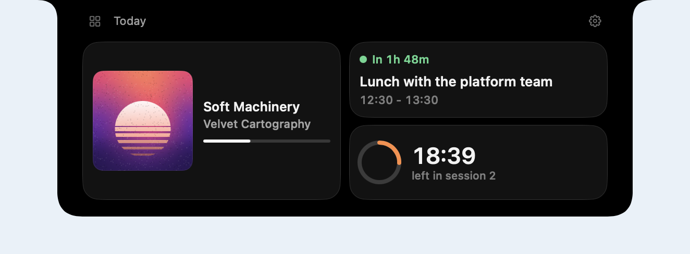

A module is a whole app: it has a home, a pill, a peek, and its own Settings. A widget is
a smaller view of the same module, the way an app on a phone has both its app and its
widgets. A board is a module whose home is a grid of widgets from every loaded module, so
a music player, a calendar and a timer can sit side by side in one expanded view.



`swift run ShowcaseNook --scene board` runs one: three resident modules and a board.

## Offering widgets

A module adds widgets to its configuration. Each has an id, a title, and the sizes it can
show at, the preferred one first. The content reads the module's own state, so it updates
in place.

```swift
configuration.addWidget(
    NookWidget(id: "now-playing", title: "Now playing", symbol: "music.note", sizes: [.medium, .large]) { size in
        NowPlayingWidget(player: player, showsQueue: size == .large)
    }
)
```

A widget draws content only. The grid draws the card around it from the theme's
`widget.card.*` tokens, so widgets from different modules look like one set.

Widgets that come and go while the nook runs (one per open project, one while a call is
live) belong in a `NookWidgetSource`:

```swift
let widgets = NookWidgetSource()
configuration.widgetSource = widgets
widgets.set(NookWidget(id: "call", title: "Call") { _ in CallWidget(call: call) })
widgets.remove(id: "call")
```

## Sizes

A size is a span on a column grid, four columns wide by default:

| Size | Span |
|---|---|
| `.small` | 1 column, 1 row |
| `.medium` | 2 columns, 1 row |
| `.large` | 2 columns, 2 rows |
| `.wide` | the whole row |

Any other span works too: `NookWidgetSize(columns: 3, rows: 1)`. The content builder
receives the size, so one widget can lay itself out differently for each.

Widgets go on the grid in order, row by row. A widget that does not fit beside the last
one starts the next row, and nothing moves back to fill a gap, so the order you see is
the order set, and resizing one widget never jumps another ahead of it.

## A grid in your own home

`NookWidgetGrid` lays out widgets in any view. A single-module app can build its home
from its own widgets:

```swift
configuration.setHome {
    NookWidgetGrid(widgets, sizes: ["calendar": .large], columns: 4)
}
```

`cardStyle: .plain` drops the cards and draws the widgets straight on the chrome.

## Boards

A board is registered like a module and shows in the module switcher:

```swift
var board = NookBoardConfiguration(id: "today", displayName: "Today", icon: "square.grid.2x2")
board.defaultLayout = [
    NookWidgetPlacement(moduleID: "music", widgetID: "now-playing", size: .large),
    NookWidgetPlacement(moduleID: "calendar", widgetID: "next"),
]
host.registerBoard(board)
```

It shows the widgets of every loaded module. A module that should always be on the
board is resident and loads at launch, the same rule live activities from the
background follow:

```swift
var descriptor = NookModuleDescriptor(id: "music", displayName: "Music", backgroundPolicy: .stayResident)
descriptor.loadsAtLaunch = true
```

A board never loads or unloads other modules. `admits: .modules(["music", "calendar"])`
limits it to some modules, and several boards can show different widgets.

The order is the person's saved layout first, then the host's `defaultLayout`, then
every other widget the board admits, by module registration order. A saved widget whose
module is not loaded keeps its place and comes back to it.

Each widget draws in its own module's scope: `\.appServices` and `\.nookLiveActivities`
are its module's, while the board's theme, metrics and type surround it. A widget with
`action: .openModule` switches to its module when clicked; `.perform { ... }` runs a
closure. The default, `.none`, leaves clicks to the widget's own controls.

`customize` changes the board's configuration before it is used, for its theme, labels
or top bar:

```swift
board.customize = { configuration in
    configuration.chromeTheme = todayTheme
}
```

## Arranging a board

The board's Settings list its widgets. People drag a row to move a widget, switch it on
or off, and pick a size from the sizes it offers. A widget's own settings
(`NookWidget.setSettings(_:)`) appear under its row, so they are there even while its
module is not in front. "Reset layout" returns to the host's layout. Layouts are saved
per board in the app's preferences.

`isLayoutLocked: true` keeps the host's layout and leaves the editor out.

## Height

A board's grid grows with its rows, up to `widget.board.maxHeight` (320), then scrolls.
A module's own `NookWidgetGrid` has no cap; give it a frame if the home should stop
growing.

## Tokens

| Token | Default | |
|---|---|---|
| `widget.gap` | `{space.md}` (8) | space between widgets |
| `widget.rowHeight` | 72 | one grid row |
| `widget.board.maxHeight` | 320 | taller boards scroll |
| `widget.card.cornerRadius` | 16 | the chrome's 24 less its 8 point edge padding |
| `widget.card.padding` | `{space.lg}` (10) | margin inside a card |
| `widget.card.background.color` | `{color.fill.subtle}` | card fill |
| `widget.card.border.color` | `{color.stroke.subtle}` | card hairline |
| `motion.widgetLayout` | `{spring.default}` | how widgets move when the layout changes |

With a theme's `motion.stagger` above 0, the cards cascade in as the nook opens, in grid
order, and an awaited `expand()` waits for the last one.
